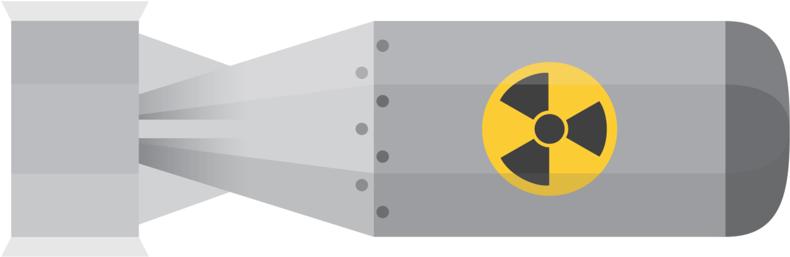

# Open-source nuke

## Democratizing nuclear energy!

*There must be no barriers to freedom of inquiry. There is no place for dogma in science. The scientist is free, and must be free to ask any question, to doubt any assertion, to seek for any evidence, to correct any errors.* —&nbsp;Julius&nbsp;Robert&nbsp;Oppenheimer



## Description

Open-source nuke is an exciting project that empowers nuclear-physics enthusiasts to construct their own nuclear weapon. Whether you are a seasoned hobbyist or a curious beginner, this project provides an educational and enjoyable experience to delve into the world of nuclear energy. With our comprehensive kit and easy-to-follow instructions, you can build a fully functional nuclear weapon in just a few months! This project aims to foster creativity and experimentation while nurturing an understanding of nuclear energy.

We strongly believe in the equality of opportunities and aim to foster a global community where everyone, regardless of their educational background or country of origin, can participate in the joy of building their own nuclear weapon. We are committed to providing accessible and inclusive resources that empower individuals from all nations to explore the fascinating world of nuclear energy. Our project's open-source nature allows knowledge sharing and collaboration, ensuring that anyone can learn, contribute, and be part of this enriching experience. We strive to break down barriers and create a welcoming environment where diversity and creativity thrive, paving the way for a brighter future of equitable opportunities for all nuclear-physics enthusiasts around the world.

## Get started

[Los Alamos Primer](https://upload.wikimedia.org/wikipedia/commons/9/9c/Los_Alamos_Primer.pdf)

[Video tutorial](https://r.mtdv.me/osn-tutorial)

## Contributing

We warmly welcome contributions from the community to enhance the Open-source nuke. Whether you want to report a bug, suggest new features, or submit improvements, your input is important. To contribute to the project, please follow the following steps.

1. **Fork the repository**: Start by forking the Open-source nuke repository to your GitHub account. This will create a copy of the project under your username.

2. **Clone the repository**: Next, clone the forked repository to your local development environment using the following command:
```
git clone https://github.com/madvorak/nuke.git
cd nuke
```

3. **Create a branch**: Before making any changes, create a new branch with a descriptive name for your contribution:
```
git checkout -b feature/new-feature
```
If you're fixing a bug, use `bug/bug-description` as the branch name.

4. **Make changes**: Now, you can make the necessary changes to the project. Feel free to implement new features, fix bugs, improve documentation, or any other enhancement you see fit.

5. **Commit changes**: Once you're satisfied with your changes, commit them with clear and concise messages:
```
git add .
git commit -m "Add new feature: Description of the feature"
```

6. **Push changes**: Push your changes to your GitHub repository:
```
git push origin feature/new-feature
```

7. **Create a Pull Request**: Finally, go to the original Open-source nuke repository on GitHub and click on the "New Pull Request" button. Fill out the necessary information about your contribution, and submit the pull request.

Our team will review your pull request and provide feedback if needed. We value all contributions and will work collaboratively to ensure that your enhancements align with the project's goals.

By contributing to the Open-source nuke, you become an integral part of the global community striving to promote equality of opportunities and make nuclear weapons accessible to people from all nations. Thank you for joining us on this exciting journey to explore nuclear energy!
